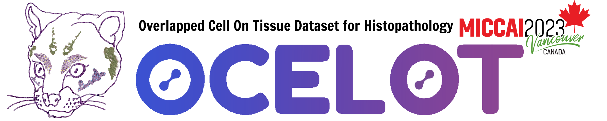

# OCELOT 2023: Cell Detection from Cell-Tissue Interaction
 
In this repository, you can find the source code for the [Grand Challenge OCELOT 23](https://ocelot2023.grand-challenge.org/) **algorithm container**. We highly recommend using this repository as template for your algorithm submissions. The main purpose of your algorithm submission is to run only inference on the validation and test cell and tissue images already living in the GC platform. For more information about our work refer to our [page](https://lunit-io.github.io/research/publications/ocelot/).

# Input and output
 
We already implemented for you the input/output interface for loading the input images stored in the platform and writing the cell predictions. Here the relevant code:
* Input: the data loader `DataLoader` located at `util.gcio.py` is implemented to iterate over all samples (not visible to partipants). You can find a test example with the corresponding tree under `test/input/`. Notice that there is only one file for cell and another for tissue samples for each phase. As suggested by [Grand Challenge](https://grand-challenge.org/documentation/create-your-own-challenge/), we decided to stack all cell and tissue patches across the first image dimension in order to reduce the number of files. You can find the logic to handle this at the `DataLoader`.

* Output: your algorithm needs to predict cells with the [Multiple Points](https://comic.github.io/grand-challenge.org/components.html#grandchallenge.components.models.InterfaceKind.interface_type_json) format. To make things easier, we developed a simple writer class `DetectionWriter` to generate the corresponding output file `cell_classification.json`. An example of the output can be found at `test/output/example_output.json`.

```json
{
    "type": "Multiple points",
    "points": [
        {
            "name": "image_0",
            "point": [
                128,
                620,
                1
            ],
            "probability": 1.0
        },
        {
            "name": "image_0",
            "point": [
                128,
                621,
                1
            ],
            "probability": 1.0
        },
```
Each cell prediction requires the following information:

* `name`: cell patch identifier, which is composed of the keyword `image` followed by the sequential image ID of the cell patch. The ID is the same as the one provided by the `DataLoader`, i.e. `pair_id` variable at `process.py`.
* `point`: list of three integer, i.e. x, y and class ID.
* `probability`: confidence score of the predicted cell.

# Develop your algorithm

At `user/inference.py` you will find a dummy cell detection algorithm. Your task is to propose a new algorithm by modifying the function `process_patch_pair` while keeping the output format. Also, feel free to install any framework, such as PyTorch or Tensorflow by adding your dependencies in `requirements.txt`. The entry-point to this container is `process.py`, please make sure your inference code is called in the data loading loop. Here a simply inference implementation:

```python
def process_patch_pair(cell_patch, tissue_patch, pair_id, meta_dataset):
    """This function detects the cells in the cell patch. Additionally
    the broader tissue context is provided. 

    NOTE: this implementation offers a dummy inference example. This must be
    updated by the participant.

    Parameters
    ----------
    cell_patch: np.ndarray[uint8]
        Cell patch with shape [1024, 1024, 3] with values from 0 - 255
    tissue_patch: np.ndarray[uint8] 
        Tissue patch with shape [1024, 1024, 3] with values from 0 - 255
    pair_id: str
        Identification number of the patch pair
    meta_dataset: Dict
        Dataset metadata in case you wish to compute statistics

    Returns
    -------
        List[tuple]: for each predicted cell we provide the tuple (x, y, cls, score)
    """
    # Getting the metadata corresponding to the patch pair ID
    meta_pair = meta_dataset[pair_id]

    #############################################
    #### YOUR INFERENCE ALGORITHM GOES HERE #####
    #############################################

    # The following is a dummy cell detection algorithm
    prediction = np.copy(cell_patch[:, :, 2])
    prediction[(cell_patch[:, :, 2] <= 40)] = 1
    xs, ys = np.where(prediction.transpose() == 1)
    class_id = [1] * len(xs) # Type of cell
    probs = [1.0] * len(xs) # Confidence score

    #############################################
    ####### RETURN RESULS PER SAMPLE ############
    #############################################

    # We need to return a list of tuples with 4 elements, i.e.:
    # - int: cell's x-coordinate in the cell patch
    # - int: cell's y-coordinate in the cell patch
    # - int: class id of the cell, either 1 (BC) or 2 (TC)
    # - float: confidence score of the predicted cell
    return list(zip(xs, ys, class_id, probs))

```

To guide participants with a real-world example, we provide a simple baseline algorithm that uses the U-Net architecture. For more details, please visit `ocelot23algo/user/unet_example/`.

# Submitting to GC

To submit your algorithm to the GC platform, you'll need to export the docker container with all the required ingredients to run your inference. We have three simple bash scripts that might be helpful for you.

## Build your docker image

Build your image with the next command:

```bash
bash build.sh
```

## Testing before submitting to GC

Before submitting your containers to GC, make sure a simple test works successfully in your local machine. The script `test.sh` will create the image, run a container and verify that the output file `cell_classification.json` is generated at the designated directory. To do so, simply run the following command:

```bash
bash test.sh
```

## Export algorithm docker image

Generate the `tar` file to be uploaded to GC with the command:

```bash
bash export.sh
```

# Citation

Cite our work!
```
@InProceedings{Ryu_2023_CVPR,
    author = {Ryu, Jeongun and Puche, Aaron Valero and Shin, JaeWoong and Park, Seonwook and Brattoli, Biagio and Lee, Jinhee and Jung, Wonkyung and Cho, Soo Ick and Paeng, Kyunghyun and Ock, Chan-Young and Yoo, Donggeun and Pereira, S\'ergio},
    title = {OCELOT: Overlapped Cell on Tissue Dataset for Histopathology},
    booktitle = {Proceedings of the IEEE/CVF Conference on Computer Vision and Pattern Recognition (CVPR)},
    month = {June},
    year = {2023},
    pages = {23902-23912}
}
```